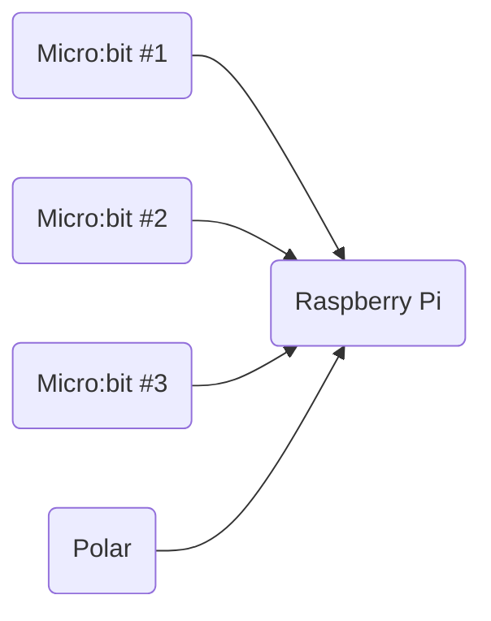
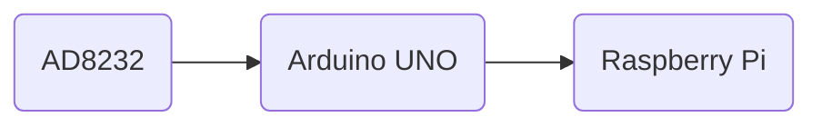
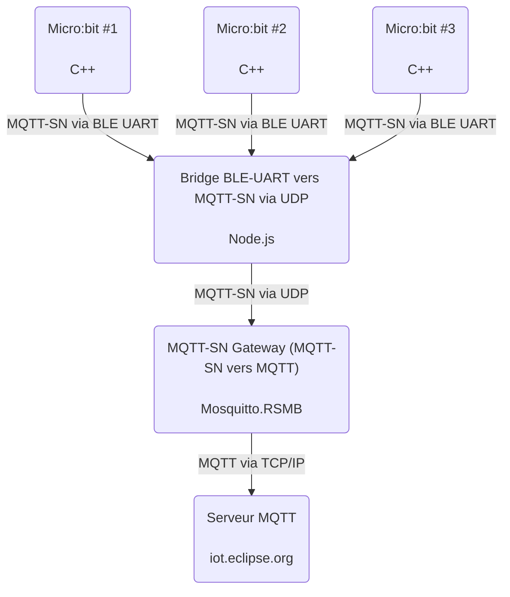
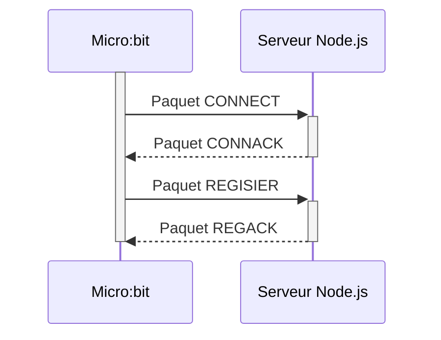
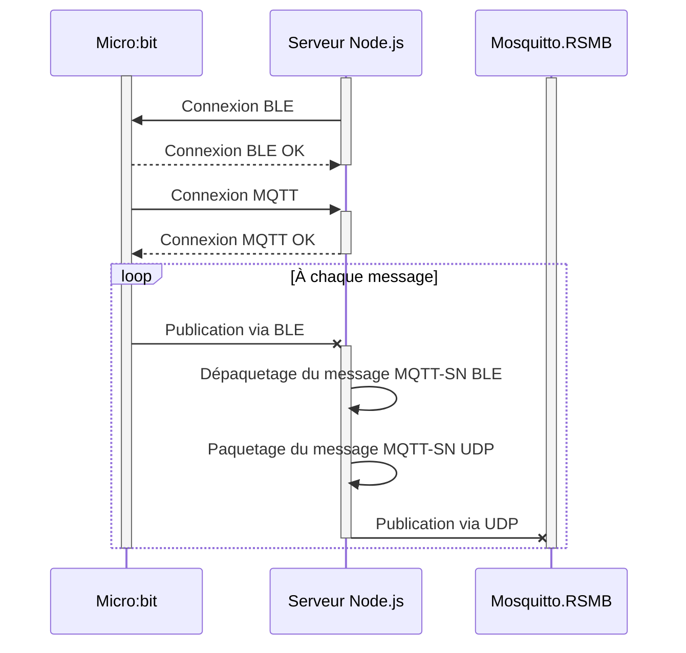
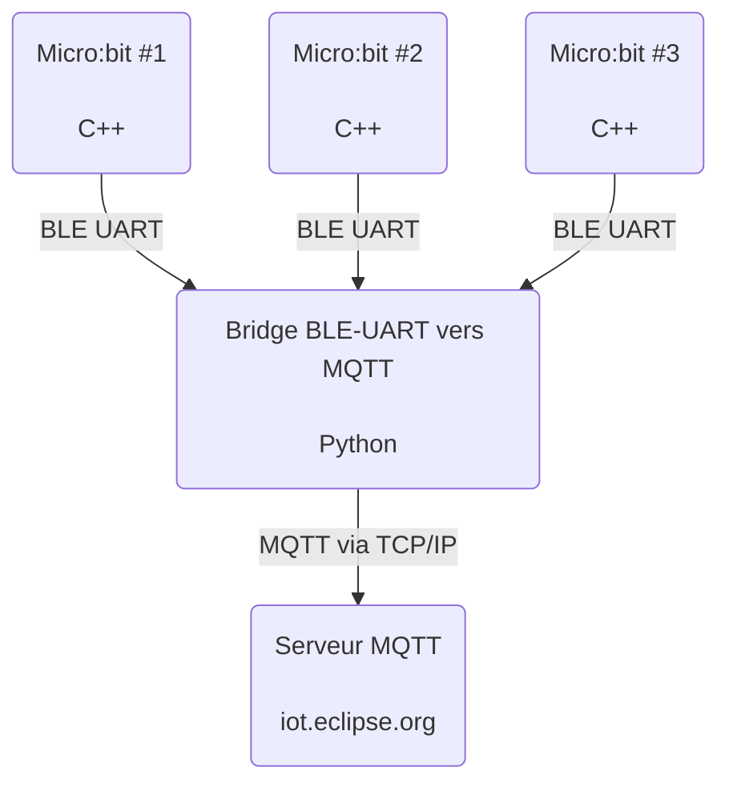

<div style="font-size:var(--h1-fontsize);margin-bottom:1.5rem;font-weight:300;color:var(--header-color);">Remerciements</h1>

​	Avant toute chose, je tiens à remercier et à exprimer toute ma gratitude aux personnes suivantes, pour cette expérience enrichissante et professionnalisante. Qu'elles soient en France, aux États-Unis, ou ailleurs, elles ont permis que mon stage se déroule sans encombre et ont toutes été d'un grand recours.

​	**Monsieur Venkatesan Muthukumar**, mon tuteur, pour m'avoir permis d'effectuer mon stage au sein de l'Université du Nevada, Las Vegas *(UNLV)* et pour la confiance qu'il m'a accordé. Il m'a donné plusieurs missions qui m'ont fait découvrir de nouvelles technologies, et amélioré mes compétences techniques. Son équilibre entre liberté et supervision m'a laissé m'épanouir dans mon travail, tout en ayant quelqu'un à qui parler en cas de problème. Il m'a aussi permis de donner des cours au sein de l'UNLV.

​	**Madame Jennifer Reff**, assistante administrative du Electrical and Computer Engineering Department, pour m'avoir assisté dans les démarches auprès de l'United States Social Security Administration *(SSA)* afin de pouvoir travailler à l'UNLV en parallèle de mon stage.

​	**Monsieur Jaekeun Cho**, coordinateur du programme d'échange, pour avoir pris en charge mon dossier et pour m'avoir recommandé auprès de mon tuteur à la vue de mes anciens projets en lien avec le rythme cardiaque. 

​	**Monsieur Jason Lawrence**, conseiller aux étudiants internationaux, pour m'avoir guidé lors de mon arrivée à l'UNLV.

​	**Monsieur Patrick Albers**, professeur au sein de l'ESEO, pour m'avoir guidé et suivi pendant mon stage. 

​	**Messieurs Charles Cerisier, Yann Le Gall, Alex Manceau**, étudiants ESEO, avec qui je suis parti aux États-Unis et avec qui j'ai découvert une partie de la côte ouest de ce pays, rendant cette aventure aussi intéressante professionnellement que culturellement.

​	Je conclus ces remerciements en remerciant l'**ESEO**, pour m'avoir fourni une méthode d'apprentissage et une rigueur indispensable à la réalisation de ce stage technique.

<div style="page-break-after: always;"></div> 
<div style="font-size:var(--h1-fontsize);margin-top:2rem;margin-bottom:1rem;font-weight:300;color:var(--header-color);">Introduction</h1> 
</div>

​	Dans le cadre de ma formation d'ingénieur ESEO, j'ai eu l'occasion de réaliser un stage technique après ma première année du cycle ingénieur. Il est extrêmement important puisqu'il permet de découvrir le monde professionnel et de mettre ses compétences en action. 

​	Au terme de mes études, je souhaite travailler à l'étranger, au Canada ou aux États-Unis. L'ESEO a des partenariats avec des universités dans ces deux pays : l'UNLV et l'Université de Sherbrooke. Cependant, Sherbrooke est dans la partie francophone du Canada. J'ai donc décidé de faire mon stage à l'UNLV afin de perfectionner mon anglais.

​	M. Muthukumar a décidé de me prendre en stage afin de travailler sur une nouvelle méthode de diagnostic des Traumatismes Cranio-Cérébraux *(TCC)*. Le projet demandait majoritairement des compétences en informatique et abordait des technologies que je n'avais jamais utilisées auparavant : BLE, MQTT, Micro:bit... C'est ce qui m'a séduit. De plus, mettre mes compétences au service d'une cause médicale a fini de me convaincre.

​	Beaucoup de personnes souffrent de séquelles cognitives liées à un TCC sans le savoir. Elles sont la source de ce que l'on appelle plus communément le **handicap invisible**. Elles se manifestent différemment chez chaque patient et sont souvent une association de différents troubles comme des troubles de l'attention, de la concentration, une difficulté à marcher, etc. Ces troubles ne sont pas continuels et apparaissent occasionnellement. C'est là le plus gros problème : ils sont très difficiles à détecter. **Les patients peuvent n'avoir aucun symptômes pendant les consultations, mais être quand même atteints de séquelles**. 

​	Mon stage consiste donc à créer un dispositif que les patients pourraient porter à domicile pour collecter continuellement des données accélérométriques, gyroscopiques et cardiaques. Ainsi, ce facteur aléatoire lors des consultations est supprimé. Le patient n'aura plus qu'à donner l'heure à laquelle il a ressenti les symptômes, et le médecin pourra extraire les données récoltées à ce moment. De plus, il devra aussi être possible au médecin de voir en temps réel les données accélérométriques et gyroscopiques.

​	La programmation s'est faite en C++, en Python et en Javascript. J'ai travaillé sur des systèmes Linux et des architectures ARM, et j'ai envoyé des comptes rendus au minimum deux fois par semaine à mon tuteur. De plus, nous faisions des réunions hebdomadaires.

​	Le but de ce rapport de stage est de présenter l'UNLV et le contexte de mon projet dans un premier temps, puis d'exposer le résultat de mon travail pendant ces trois mois. Enfin, je ferai le bilan des compétences acquises pendant mon stage.

<div style="page-break-after: always;"></div> 
<div style="font-size:var(--h1-fontsize);margin-top:2rem;margin-bottom:1rem;font-weight:300;color:var(--header-color);">Fiche de synthèse du stage</h1> 
</div>

**Sujet** : Développement d'une nouvelle façon de détecter des séquelles des Traumatismes Cranio-Cérébraux

**Entreprise** : Université du Nevada, Las Vegas (UNLV)

**Dates de stage** : Débuté le 27 Aout 2018, terminé le 30 Novembre 2018

**Principales personnes avec qui j'ai travaillé** : Monsieur Venkatesan Muthukumar, mon tuteur

**Planning résumé** : 

- Prise en main du matériel (Micro:bit, Raspberry Pi, Arduino, AD8232, capteur Polar)
- Développement d'un programme C++ d'acquisition d'informations accélérométriques et gyroscopiques sur un Micro:bit en utilisant le MQTT-SN via BLE
- Modification du programme d'acquisition d'informations accélérométriques et gyroscopiques sur un Micro:bit en utilisant le BLE sans MQTT-SN
- Optimisation bas niveau du programme afin de pouvoir transmettre plus d'informations via BLE
- Création d'une  base de données MySQL pour stocker les données acquises
- Développement en Python d'un système d'envoi et de stockage d'informations vers un serveur MQTT et sur une base de données MySQL
- Modification d'un ancien programme Arduino (C) d'acquisition du signal cardiaque (patient immobile) pour l'adapter au capteur AD8232
- Modification d'un GUI Python afin d'afficher le signal cardiaque
- Création d'un programme Python d'analyse du signal cardiaque pour en extraire les pics P, Q, R, S et T, puis les afficher
- Ajout d'une fonctionnalité d'export des pics vers un fichier CSV
- Développement d'un programme Python d'acquisition du nombre de Battements Par Minute (BPM)  en utilisant un capteur Polar
- Développement d'un GUI Javascript / HTML / CSS afin d'afficher les informations accélérométriques, gyroscopiques et cardiaque (capteur Polar) récupérées sur le serveur MQTT
- Écriture d'un document expliquant comment utiliser mes programmes

**Contraintes et difficultés rencontrées** : Le traitement des informations en temps réel à été une difficulté pour le développement des programmes. Le fonctionnement mission par mission a parfois été compliqué. En effet, au début de mon stage, mon tuteur me donnait une tâche à la fois, et une réunion était nécessaire pour avoir une nouvelle tâche. Cela a engendré une perte de temps au début du stage. De plus, j'ai été confronté à un problème que j'ai mal analysé dans le fonctionnement du BLE. Cela m'a causé quelques désagréments. J'y reviens en détail au sein de ce rapport.

**Résultats** : Le système d'acquisition, de transmission et de stockage d'informations accélérométriques, gyroscopiques et cardiaques (BPM) a été testé pendant 8h consécutives sans problème. Le système d'acquisition du rythme cardiaque sur un patient immobile et de traitement des pics P, Q, R, S et T a été testé 10 fois pendant 20 min consécutives sans problème.

<div style="page-break-after: always;"></div> 
<div style="font-size:var(--h1-fontsize);margin-top:2rem;margin-bottom:1rem;font-weight:300;color:var(--header-color);">Sommaire</h1> 
</div>

[TOC]

<div style="page-break-after: always;"></div> 

# La société et le contexte

## Las Vegas

Las Vegas est la plus grande ville de l'état du Nevada. La ville est située au milieu du désert des Mojaves. Elle est aujourd'hui considérée comme la capitale des casinos.

### L'histoire de Las Vegas

La ville de Las Vegas voit le jour en 1905. Située sur le trajet Los Angeles - Est des États-Unis, c'est un arrêt d'approvisionnement en eau pour les convois de chariots et pour les chemins de fer. Peu après la création de la ville, le Nevada interdit les jeux d'argent en 1910. Néanmoins, cela a peu d'impact, Las Vegas ayant une économie diversifiée et n'étant pas encore centrée sur les casinos. 

En 1930, le président Herbert Hoover donne son accord pour le barrage Boulder, qui sera renommé Hoover Dam (barrage Hoover) sous l'administration Truman. Les travaux commencent en 1931, et grâce à l'afflux d'ouvriers, la population de la ville quintuple, atteignant les 25 000 habitants. Du fait de la démographie de la population, majoritairement masculine et célibataire, Las Vegas connu un essor important dans le marché des grands spectacles de divertissement, le tout financé par la mafia et par des financiers Mormons. Des casinos illégaux, gérés par la mafia, commencent à faire leur apparition.

L'année suivante, l'État du Nevada légalise localement les jeux d'argent, réalisant que le jeu serait rentable pour l'économie locale. Le comté distribue les premières licences de jeu dans la foulée, et Fremont Street devient un des hauts lieux du jeu local, avec le *Northern Club*, mais aussi le *Las Vegas Club* ou l'*Hôtel Apache*. Las Vegas devient aussi un des bastions de la mafia, les casinos permettant de blanchir de l'argent assez facilement.

En 1940, une nouvelle partie de l'U.S. Route 95 est construite, donnant à la ville deux routes d'accès principales. C'est encore aujourd'hui un des axes majeurs du Nevada.

Le 3 avril 1941, Thomas Hull, un grand propriétaire d'hôtels, ouvre l'*El Rancho Vegas* sur ce qui deviendra plus tard l'avenue mythique du *Strip*. Cinq ans plus tard, en 1946, Meyer Lansky, un grand nom de la mafia, ouvre le Flamingo, lui aussi sur le Strip. Il est alors considéré comme l'hôtel le plus luxueux au monde. Cela attire de nombreux truands, qui investiront à leur tour avec la complicité de certains banquiers Mormons. De nombreux hôtels-casinos furent ainsi créés. 

En 1951, la commission de l'énergie atomique des États-Unis choisit le site d'essais du Nevada, à 180 km de Las Vegas, pour procéder au premier essai nucléaire de l'histoire du pays. Loin des dangers et des risques, la ville de Las Vegas décida d'annoncer les explosions comme des attractions touristiques majeures, allant jusqu'à créer des chambres d'hôtel spéciales pour avoir une vue sur les nuages en champignons. L'afflux de touristes et d'employés gouvernementaux oblige le comté à créer l'aéroport Mc Carran, qui deviendra plus tard un aéroport international avec l'augmentation massive de voyageurs. Les essais nucléaires se dérouleront en plein air jusqu'en 1963, date de leur interdiction suite à la promulgation du Traité d'interdiction partielle des essais nucléaires.

Tandis que les casinos et les hôtels continuent de se développer sur le *Strip*, Howard Hughes, un héros de l'aviation américaine, décide en 1961 de s'associer au gouvernement pour racheter des casinos gangrenés par la mafia. Il devient rapidement un des hommes puissants de Las Vegas, et met en route une large vague contre la corruption et la mafia au sein de la ville, notamment grâce à l'aide du journal local *Las Vegas Sun*, qui révèle que le Shérif du comté est impliqué dans des affaires de prostitution.

L'époque de la mafia prend fin, et à partir de 1980, de nouveaux entrepreneurs arrivent et ouvrent un nouveau chapitre de la ville : l'époque des méga-hôtels. De nombreux établissements somptueux et iconiques sont construits : *Rio*, *Excalibur*, le *MGM Grand*, la *Stratosphere Tower*, le *Bellagio*, etc. Las Vegas devient un endroit commercial et familial.

Las Vegas s'est aujourd'hui imposée comme la capitale du jeu, de l'hôtellerie de luxe, et du divertissement. 

### La situation actuelle de Las Vegas

La ville de Las Vegas se trouve dans le sud de l'État du Nevada, dans le comté de Clark (Clark County). La commune s'étend sur une superficie de 352 km<sup>2</sup>. La population en 2017 était estimée à 648 000 habitants. 

Cependant, la situation démographique de Las Vegas est complexe. En effet, l'agglomération de Las Vegas ne correspond pas du tout à son aire métropolitaine. Or, ce que l'on appelle communément "Las Vegas" dépasse les frontières officielles de la ville. L'exemple le plus flagrant est le fait que le *Strip* ne fait pas partie de la ville de Las Vegas, mais des "Unincorporated towns" (des zones ne dépendant d'aucune municipalité) de Paradise et de Winchester. L'UNLV ne fait pas non plus partie de Las Vegas, mais de Paradise. 

En prenant en compte ces différentes zones, la population de ce que l'on appelle à tord "Las Vegas" approche les 2 000 000 d'habitants. Dans ce document, sauf mention contraire, c'est cette zone que l'on appellera "Las Vegas".

La ville est située dans une vallée et est entourée de montagnes. Différents parcs d'état ou nationaux sont limitrophes : *Red Rock Canyon National Park*, *Valley of Fire State Park*, *Lake Mead National Recreation Area* et *Sloan Canyon National Conservation Area*. Le climat y est évidemment désertique, ce qui est un problème majeur pour l'approvisionnement en eau. La croissance démographie entraîne des besoins de plus en plus importants, que le lac Mead (lac artificiel de 32 000 km<sup>3</sup>, 885 km de rivage, créé par le barrage Hoover) a de plus en plus de mal à satisfaire. La municipalité prend des mesures drastiques contre le gaspillage de l'eau, au point que des amendes pouvant aller jusqu'à $5 000 ont été instaurées si des fuites d'eau étaient trouvées chez un particulier. La Southern Nevada Water Authority (SNWA) envisage de construire un aqueduc pour aller chercher l'eau nécessaire à la ville à 500 km au nord de Las Vegas.

La ville de Las Vegas est composée de différents quartiers, mais deux d'entre eux sont atypiques et très dépaysants : Downtown et le Strip.

Downtown est situé dans la partie Nord de Las Vegas, c'est le quartier historique de la ville. Les premiers hôtels et casinos s'y sont installés. Le quartier est centré sur Fremont Street, l'artère principale qui parcourt Downtown. La partie Nord de cette avenue est appelée Fremont Street Experience (FSE) et est réservée aux piétons. Le quartier est en fête tous les soirs, et rassemble ainsi des centaines de personnes, touristes comme locaux. L'attraction principale est un écran géant incurvé à 27 m de haut et de 460 m recouvrant toute la rue. Différents shows sont diffusés sur cet écran, assorti d'un gros système sonore. La rue est pleine de casinos, mais aussi de différents lieux promouvant l'art sous toutes ses formes : scènes de spectacles, peintres, graffitis, mimes, sculpture, théâtre, chant, musique, etc. Ce qui en fait un haut lieu culturel de la région. La zone est très contrôlée, notamment depuis la tuerie ayant fait 59 morts et 851 blessés le 1<sup>er</sup> octobre 2017 dans Paradise. Il s'agit de la tuerie de masse la plus importante de l'histoire des États-Unis.

Le second quartier atypique est le Strip. Le Strip fait 7,2 km de long, c'est l'emblème touristique de Las Vegas, la concentration d'hôtels et de casinos y est très élevée. L'avenue est d'ailleurs reconnue comme "National Scenic Byway" par le ministère américain des transports (U.S. Department of Transportation), c'est-à-dire que la route est reconnue pour son caractère culturel et touristique. C'est d'ailleurs l'un des seuls quartiers où les infrastructures piétonnes sont très développés. On peut ainsi traverser le Strip en empruntant uniquement des passerelles reliant les différents bâtiments. L'ensemble des établissements sont à la fois des hôtels et des casinos, ce qui en fait des mini-villes. Les complexes sont presque tous basés sur des thèmes différents, afin d'attirer une clientèle variée et cibler certaines classes sociales.

## L'Université du Nevada, Las Vegas (UNLV)

J'ai effectué mon stage au sein du College of Engineering de l'Université du Nevada, Las Vegas. Véritable ville dans la ville, plus de 30 000 étudiants y font leur études pour acquérir l'un des 350 diplômes que l'école offre. La directrice actuelle est Marta Meana, instituée le 1<sup>er</sup> juillet 2018.

Comme expliqué précédemment, la région de Las Vegas a été choisie en 1951 comme lieu phare des essais nucléaires américains. L'afflux d'employés gouvernementaux a créé un changement démographique dans la population de Las Vegas. La demande en éducation étant de plus en plus importante, une université fut créée en 1957, alors considérée comme une extension régionale de l'Université de Reno, la première université publique créée au Nevada. Les premiers diplômés sortirent de l'école en 1964. L'université fut ensuite temporairement appelée *Nevada Southern University*, puis s’émancipa de l'Université de Reno en 1969, année où le nom University of Nevada, Las Vegas (UNLV) fut officialisé.

Depuis, l'Université ne cesse de grandir, étoffant régulièrement les diplômes proposés, et son rayonnement national et international s’accroît. C'est par exemple l'UNLV qui a accueilli le dernier débat présidentiel entre Hillary Clinton et Donald Trump. L'école de journalisme de l'UNLV a couvert le débat sur la chaîne locale UNLV-TV.

Le pôle de recherche est reconnu comme étant un des pôles majeurs aux États-Unis. Les fonds y étant alloués sont en augmentation depuis quatre ans. 61 brevets ont ainsi été déposés en 2016.

Le campus fait 144 hectares et est situé au milieu de Las Vegas, entre le Strip et l'aéroport Mc Carran. Le bâtiment dans lequel j'ai travaillé est le *Science and Engineering Building* (SEB). Le bâtiment permet aux facultés de sciences, d'ingénieurie et de médecine de collaborer sur des projets communs. Notamment grâce à des équipements modernes et innovants tels que des microsondes EPMA (analyses chimiques non-destructives), des laboratoires spécialisés dans la culture de cellules eucaryotes (reproduction de tissus), ou encore des salles blanches dédiées à l'étude des nanotechnologies. 

## Le projet et sa place dans la médecine actuelle

Tous les jours aux USA, 153 personnes meurent d'un Traumatisme Cranio-Cérébral (TCC, ou Traumatisme Crânien).[^1] C'est l'une des principales causes de mortalité et de handicap sévère avant 45 ans. 

La notion de TCC couvre à la fois les traumatismes touchant la partie haute du crâne, et ceux touchant le cerveau. On y associe aussi parfois d'autres autres lésions cérébrales comme les accidents vasculaires cérébraux, les ruptures d'anévrysmes, les tumeurs, etc. Les principales lésions sont causées par l'accélération, la décélération ou la rotation violente du cerveau. C'est pourquoi ils sont principalement causés par les chutes et accidents de la route.[^1] D'autres lésions, appelées des contusions, sont dues à l'impact du cerveau contre les reliefs osseux à l'intérieur du crâne. Toutes ces lésions peuvent être plus ou moins sévères.

La médecine sépare les différents cas en trois groupes : les TCC légers, les TCC moyens, et les TCC graves.  Le premier correspond à une brève perte de connaissance (entre 0 et 30 min) sans fracture du crâne, associée ou non à une courte amnésie (inférieure à 24h). Un TCC est caractérisé comme grave dès qu'un coma apparaît (score inférieur ou égal à 8 sur l'échelle de Glasgow). Les TCC moyens regroupent tous les cas intermédiaires.

Un tiers des patients vont souffrir de Syndrome Post-Commotionnel (SPC).[^2] En 2006, il était estimé que 5,3 millions d'Américains en souffraient.[^3] Ces symptômes peuvent apparaître immédiatement après le TCC, mais aussi quelques semaines, voir quelque mois après le choc. De plus, ils peuvent tout à faire n'être qu'occasionnels, où ne se déclencher qu'à certains moments de la journée, ou à l'effort. La nature des symptômes est majoritairement physique, mais ils peuvent devenir psychologiques.[^4] Le SPC se manifeste différemment chez chaque patient et est souvent une association de différents troubles comme des troubles de l'attention, de la concentration, une difficulté à marcher, etc. On retrouve aussi l'hyperacousie, mais aussi l'anxiété, la fatigue, et même la dépression.[^5] Des maux de tête et des pertes d'équilibre peuvent survenir après la blessure et peuvent durer très longtemps.

Les tests actuels nécessitent d'aller consulter un spécialiste et ne sont efficaces que si les symptômes sont présents au cours de l’examen. Différents tests existent pour pouvoir conclure à un SPC, comme le fait de faire marcher un patient le long d'un large cercle. Un patient ayant des difficultés à marcher ou d'autres troubles liés au SPC aura du mal à suivre parfaitement la courbe. De surcroît, dans certains cas de SPC, leur signal cardiaque est plus instable qu'un patient non-atteint. On ne peut déclarer qu'un patient est atteint d'un SPC que lorsque trois tests ou plus sont positifs.[^6]

En bref, la majorité des tests actuels nécessitent d'enregistrer des informations accélérométriques, gyroscopiques ou encore cardiaques. Mais les patients doivent encore se déplacer en hôpital ou en clinique, ce qui est un problème étant donné que les symptômes peuvent n'être qu'occasionnels.

Mon stage consiste donc à créer un dispositif que les patients pourraient porter à domicile pour collecter continuellement des données accélérométriques, gyroscopiques et cardiaques. Ainsi, ce facteur aléatoire lors des consultations est supprimé. Le patient n'aura plus qu'à donner l'heure à laquelle il a ressenti les symptômes, et le médecin pourra extraire les données récoltées à ce moment. De plus, il devra aussi être possible au médecin de voir en temps réel les données accélérométriques et gyroscopiques.

Une seconde partie de mon stage consiste à développer une solution pour afficher le signal cardiaque d'un patient immobile et en extraire les pics P, Q, R, S et T, qui peuvent être utilisés lors d'une consultation avec un médecin comme test de dépistage du SPC.

Mes travaux seront ensuite remis à deux groupes de chercheurs, l'un étant spécialisé dans l'exploitation des données accélérométriques et gyroscopiques lors des tests de SPC, l'autre dans l'exploitation des données cardiaques lors des tests de SPC.

[^1]: https://www.cdc.gov/mmwr/volumes/66/ss/ss6609a1.htm
[^2]: http://campus.neurochirurgie.fr/IMG/pdf/Epidemiologie_des_traumatismes_craniens.pdf
[^3]: https://journals.lww.com/headtraumarehab/pages/articleviewer.aspx?year=2006&issue=09000&article=00001&type=abstract
[^4]: https://pn.bmj.com/content/6/6/342 
[^5]: https://www.tandfonline.com/doi/abs/10.1080/09540260310001606692 
[^6]: https://emedicine.medscape.com/article/828904-overview

 # Mes activités pendant mon stage

## Détail des objectifs et du cahier des charges

Mon stage se décompose en plusieurs objectifs. Initialement, les objectifs étaient les suivants.

### Objectifs initiaux

1. Récupérer des données des accéléromètres / gyroscopes de 3 cartes Micro:bit en  parallèle afin de les envoyer à un serveur local (PC ou Raspberry Pi) via Bluetooth Low Energy (BLE). Le serveur doit ensuite traiter les données afin de les  formater en JSON pour finalement les envoyer vers un serveur MQTT (via le protocole MQTT). Le serveur doit pouvoir gérer à tout moment des  connexions / déconnexions d'une ou plusieurs Micro:bits sans impacter les autres Micro:bits. Un GUI doit être créé pour visualiser les données en temps réel.

2. Récupérer un signal cardiaque en utilisant un AD8232 et une carte basée sur un ATMega. Ce signal cardiaque doit ensuite être envoyé à un ordinateur (Raspberry Pi) afin d'exploiter ce signal (traitement du signal) et en déduire les valeurs suivantes :

* les timestamps des différents pics

* les types de pics

* l'intervale RR

* la Variabilité de Fréquence Cardiaque (VFC)

* les Battements Par Minute (BPM)

  Ces informations devront ensuite être envoyées périodiquement (~ toutes les 100 secondes) à un serveur MQTT.

### Objectifs finals

Le second objectif a été modifié plus tard dans le projet. La VFC n'est plus à calculer, et les informations ne sont plus à envoyer, mais uniquement à afficher et à sauvegarder localement.

En effet, je me suis aperçu que le capteur ne permet pas de récupérer le signal cardiaque quand la personne est en mouvement, le test devra donc se faire directement dans un cabinet médical. Cela n'a donc plus de sens d'envoyer les données vers un serveur distant alors que le médecin ayant besoin des informations est avec le patient.

Les objectifs finals sont donc :

1. Récupérer des données des accéléromètres / gyroscopes de 3 cartes Micro:bit en  parallèle afin de les envoyer à un serveur local (PC ou Raspberry Pi) via Bluetooth Low Energy (BLE). Le serveur doit ensuite traiter les données afin de les  formater en JSON pour finalement les envoyer vers un serveur MQTT (via le protocole MQTT). Le serveur doit pouvoir gérer à tout moment des  connexions / déconnexions d'une ou plusieurs Micro:bits sans impacter les autres Micro:bits. Un GUI doit être créé pour visualiser les données en temps réel.

2. Récupérer un signal cardiaque en utilisant un AD8232 et une carte basée sur un ATMega. Ce signal cardiaque doit ensuite être envoyé à un ordinateur (Raspberry Pi) afin d'exploiter ce signal (traitement du signal) et en déduire les valeurs suivantes en les affichant sur un GUI :

- les timestamps des différents pics
- les types de pics
- l'intervale RR
- les BPM

## Prise en main du matériel

Lors de mon arrivée, mon tuteur mon tuteur m'a transmis mon matériel. Mes premiers jours ont été centrés sur la prise en main de ce matériel. J'avais à ma disposition cinq Micro:bit, deux Raspberry Pi 3+, trois Arduino UNO, un capteur Polar H10 et un capteur AD8232. 

J'ai décidé de travailler sous Debian (Linux) pour ce projet pour trois raisons. Premièrement, beaucoup de projets et de langages sont aujourd'hui adaptés premièrement pour Linux. Ensuite, Linux est très utilisé dans le monde de l'informatique. Il me semblait donc nécessaire de m'améliorer sur ce système d'exploitation (Operating System, OS). Finalement, la Raspberry Pi que j'ai utilisé dans ce projet embarquait Raspbian, un OS basé sur Debian. 

### Micro:bit

Les Micro:bit sont des cartes électroniques open-source basées sur une architecture ARM. Elles ont  été conçues par la branche éducative de la BBC ainsi que par de nombreux collaborateurs tels que NXP Semiconductors, Samsung ou encore Microsoft. Elle est dévoilée le 12 Mars 2015 et a pour but initial d'être utilisée dans le système éducatif anglo-saxon.

Elles embarquent un processeur ARM Cortex-M0, ainsi que des accéléromètres, des gyroscopes, différents capteurs, des boutons et d'une matrice de 5x5 LED. De plus, elles sont dotées d'une connectique Bluetooth Low Energy (BLE) et USB. Elles peuvent être alimentées par USB ou par une batterie externe.

Il est possible de programmer les Micro:bits en Javascript, en Python, en C/C++, en Rush, en Forth, en Pascal et en Ada. J'ai choisi d'utiliser le C/C++ car il permet d'utiliser une librairie (Data Access Layer - DAL) développée par l'Université de Lancaster. Cette librairie est très documentée et très utilisée... notamment par les bibliothèques permettant de développer en Python et en Javascript sur les Micro:bit.

Yotta est utilisé pour le build, ce qui génère un fichier .hex qu'il suffit de transférer sur le Micro:bit pour exécuter notre programme. Chose assez courante dans l'écosystème MBED.

Leur prix est abordable (environ $17), de plus l'UNLV est habituée à les utiliser, ce qui en fait une carte parfaite pour ce projet. Ils vont servir de capteurs accéléromètres et gyroscopiques et transmettront les données à la Raspberry Pi via BLE.

### Raspberry Pi 3+

La Raspberry Pi est un mini-ordinateur très connu en informatique, en électronique et en robotique. Elle aussi a été développée en Angleterre, par la Raspberry Pi Foundation, pour promouvoir l'apprentissage de l'informatique.

La Raspberry Pi 3+ embarque, entre autres, un processeur quad core 64 bits, une connectique Wifi et une connectique Bluetooth Low Energy (BLE). Une carte MicroSD fait office de disque dur. Elle s'alimente en 5V via MicroUSB ou avec une batterie externe.

J'ai choisi d'y installer Raspbian, un système d'exploitation basé sur Debian, fait spécifiquement pour la Raspberry Pi. Le prix d'une Raspberry Pi était de $35 à sa sortie, en 2012 (en version 1, la version 3+ que j'utilise est sortie en 2016 et coûte environ le même prix).

La Raspberry sera le centre de notre intelligence, c'est là que seront fait la majorité des calculs et des traitements.

### Arduino UNO

L'Arduino UNO est un microcontrôleur open-source développé par l'entreprise Arduino et basé sur un microprocesseur ATMega328P. La carte est équipée de différents GPIO digitaux et des entrées/sorties analogues. Il peut être programmé via USB, et peut être alimenté soit en USB, soit avec une batterie externe. Il servira d'interface entre le capteur AD8232 et la Raspberry Pi.

Il coûte entre \$5 et $10, selon le fabricant.

### AD8232

Le capteur AD8232 est utilisé pour acquérir le signal cardiaque. Il utilise 3 électrodes placées à différents endroits du corps. La tension dans les électrodes étant de l'ordre du mV, le AD8232 intègre des amplificateurs opérationnels (AOP) pour remonter cette tension dans des ordres de grandeur mesurables par l'Arduino. Ainsi, il est conçu pour amplifier et filtrer le bruit.

Il est produit par SparkFun et est alimenté en 3V3. Il sera donc directement branché sur l'Arduino, qui peut fournir du 3V3.

C'est l'un des capteurs les moins chers du marché (environ $20), mais cela se ressent rapidement. Effectivement, dès que le patient bouge, le signal devient inexploitable.

### Polar H10

Le capteur Polar H10 est un capteur de BPM. Il est conçu pour s'intégrer facilement avec tout autre dispositif IoT (Internet of Things) de la marque Polar (montre connectée, application Android). Les données sont envoyées via BLE, ce qui va me permettre de les exploiter directement avec la Raspberry Pi.

Le capteur coûte environ $90, mais est réputé pour sa précision et sa robustesse. 

### Schémas de fonctionnement

Pour résumer, j'ai donc décidé de créer deux systèmes indépendants afin de répondre aux deux objectifs. Dans ce rapport, j'aborderai premièrement le premier système (Diagramme #1) dédié au premier objectif, puis ensuite j'aborderai le second (Diagramme #2). Cependant, durant mon stage, j'ai travaillé sur les deux objectifs en parallèle.

#### Diagramme #1



#### Diagramme #2



## Le début du projet : l'utilisation du MQTT-SN

Lors de ma première réunion, mon tuteur m'a expliqué ce qu'il attendait de moi sur le projet. Pour cela, il m'a renvoyé vers un article de Benjamin Cabe, un développeur spécialisé dans l'IoT. Dans cet article, Benjamin Cabe explique comment il a pu envoyer les données accélérométriques et gyroscopiques  des plusieurs Micro:bit vers un serveur distant, grâce au MQTT-SN, au BLE et au MQTT. 

L'ensemble des sources de son projet est en open-source et est disponible sur [son GitHub](https://github.com/kartben). J'ai donc premièrement tenté de le faire fonctionner. J'ai dû installer les outils tels que Yotta et CMake afin de pouvoir compiler le programme. Puis j'ai installé Node.js, la partie du transfert MQTT-SN vers MQTT étant géré par un serveur Node.js.

Rapidement, Node.js est un environnement bas niveau permettant d'exécuter du code JavaScript côté serveur. Il est souvent utilisé comme serveur web. Son fonctionnement est basé sur une programmation événementielle, ce qui lui permet d'être très rapide par rapport aux langages plus lourds comme le PHP. La popularité de ce langage est au plus haut, et de plus en plus d'entreprises passent à Node.js, comme Paypal, Microsoft, Walmart ou encore LinkedIn. 

Sur Debian, Node.js ne peut être installé avec un simple apt ou apt-get. En effet, les dépôts traditionnels ne fournissent pas les bonnes versions. J'ai alors dû ajouter les dépôts de Nodesource, l'entreprise chargée de la distribution de Node.js sur Debian notamment. Pour cela, il suffit d'exécuter un script bash qui ajoute la clé publique GPG de Nodesource, puis ajoute leur dépôt dans la liste des dépôts apt. 

```shell
curl -sL https://deb.nodesource.com/setup_8.x | bash -
sudo apt-get install -y nodejs
sudo apt-get install -y build-essential
```

Ceci étant fait, je me suis ensuite plongé dans le code source afin d'en comprendre le fonctionnement. Je commence par m'intéresser au fonctionnement global, notamment aux interactions entre les différents composants, entre les différents programmes.

Pour commencer, les trois Micro:bit transmettaient les informations grâce au protocole MQTT-SN via BLE UART. Afin de bien comprendre ce qu'est le MQTT-SN, j'ai d'abord dû me renseigner sur le MQTT.

Le protocole MQTT (Message Queuing Telemetry Transport) est un protocole de messagerie de type publish-subscribe basé sur le protocole TCP/IP. Le principe d'un système de messagerie de type publish-subscribe est le suivant : les messages sont classés par catégories (ou topics) et les destinataires peuvent s'abonner aux différentes catégories, et être ainsi avertis à chaque nouveau message publié les concernant. Le protocole a vu le jour en 1999, et est aujourd'hui défini par un standard ISO (ISO/IEC 20922). 

Des serveurs MQTT sont utilisés dans énormément d'applications nécessitant un court délai, comme les services de chat. Ainsi, Facebook révélait en 2015 que son application de chat Facebook Messenger utilise un broker MQTT (un serveur MQTT est plus communément appelé un *broker*).

Avec l'arrivée de l'IoT, il fallait créer un protocole de publish-subscribe ne se basant pas sur le protocole TCP/IP. En effet, la couche TCP/IP peut être lourde et non-adaptée pour de simples objets de l'IoT. C'est ainsi qu'est né en 2007 le MQTT-SN (MQTT Sensor Network). C'est une adaptation du MQTT à d'autres protocoles que le TCP/IP, tels que l'UDP ou le BLE UART (émulation d'une liaison série via Bluetooth Low Energy). 

J'avais maintenant toutes les clés en main pour comprendre le fonctionnement du projet de Benjamin Cabe. Les Micro:bits transmettent donc les données en utilisant le protocole MQTT-SN via BLE UART. Cependant, la destination finale est un broker MQTT, et non MQTT-SN. Il faut donc encore d'autres étapes avant d'arriver au broker final.

Un des logiciels utilisés pour faire cette conversion est [Mosquitto.RSMB](https://github.com/eclipse/mosquitto.rsmb) (Eclipse Foundation). RSMB prend en entrée des paquets MQTT-SN via UDP puis les envoie vers un broker MQTT via TCP/IP. Problème : nos paquets MQTT-SN arrivent via BLE UART, et non via UDP. Benjamin Cabe a donc dû adapter un [serveur Node.js](https://github.com/kartben/ble-uart-to-udp) s'occupant de cette tâche.

Pour résumer, j'avais donc ce schéma en tête.



J'avais à présent compris le fonctionnement global. Je me suis ensuite intéressé en détail au [programme embarqué](https://github.com/kartben/microbit-mqttsn-ble) sur les Micro:bit.

Le programme utilise Yotta, un gestionnaire de module. Tout module ou application Yotta inclus un fichier `module.json` qui renseigne, entre autres, l'ensemble des modules dont le programme est dépendant. Yotta se chargera seul de l'installation des modules (avec la commande `yotta install <nomDuModule>`) et de leur inclusion dans le code final lors du build (avec la commande `yotta build`). Le fonctionnement est similaire à d'autres gestionnaires de modules plus connus comme npm pour Node.js, ou pip pour Python. 

Je vois dans le fichier `module.json` que le programme dépend du DAL créé par la Lancaster University dont j'ai parlé dans la section 2.2.1 du document. Ce n'est pas vraiment une surprise, en effet, c'est une des bibliothèques les plus utilisées dans le domaine. 

```json
{
  "name": "microbit-mqttsn-ble",
  ...
  "dependencies": {
    "microbit": "lancaster-university/microbit"
  },
  ...
}
```

Passons maintenant au code en lui-même. Il utilise la librairie [Eclipse Paho MQTT-SN](https://www.eclipse.org/paho/), qui n'est pas déclarée dans le fichier `module.json` car non disponible sur Yotta. Les fichiers sources de la librairie sont donc directement présents dans les dossiers du programme.

Comme prévu, le programme utilise le service BLE UART. Grâce à la DAL de la Lancaster University, la syntaxe est très lisible. 

```C++
uart = new MicroBitUARTService(*uBit.ble, 128, 128);
```

Lors de la conception d'une Micro:bit, un shortname (un identifiant unique de 5 lettres, $5^{26} = 1.49*10^{18}$ possibilités) lui est attribué. C'est ce shortname qui est utilisé comme topic MQTT pour les messages envoyés. Il est accessible avec la fonction `microbit_friendly_name()`. 

C'est la phase de connexion qui prend le plus de lignes de code, notamment à cause de la gestion des erreurs. Le succès consiste en ce diagramme de séquence, l'échec en tout autre diagramme. En cas d'échec, le diagramme de séquence est repris du début.



Le paquet `REGISTER` contient le nom du topic vers lequel seront envoyé les messages publiés par la Micro:bit. Ici, le shortname.

Il ne manque maintenant plus qu'à gérer l'envoi des messages. C'est la fonction `publish(payload)` qui s'en occupe.

```c++
void publish(char * payload) {
    // Si la connexion est perdue
    if (mqttConnected == 0) {
        // On tente de se reconnecter
        int rc = mqtt_connect();
        
        // Si la reconnexion échoue, on abandonne l'envoi
        if (rc != 0) 
            return;
    } else {
        // Si la connexion est active
        
        // On définit le type de topic et l'ID du topic (le shortname)
        topic.type = MQTTSN_TOPIC_TYPE_NORMAL;
        topic.data.id = topicid;

        // On utilise la libraire Eclipse Paho pour publier le message
        len = MQTTSNSerialize_publish(buf, buflen, dup, qos, retained, packetid,
                topic, (unsigned char *) payload, strlen(payload));
        rc = transport_sendPacketBuffer(buf, len);
        
        // On fait défiler un point sur la matrice de LED pour signifier que le message est en cours d'envoi
        uBit.display.scrollAsync(ManagedString("."),10); 
    }
}
```

Mon explication du code est dans les commentaires (`// Commentaire`). 

Je me suis ensuite penché sur le serveur Node.js. Rien de bien compliqué dans cette partie. Le script utilise le paquet [noble](https://www.npmjs.com/package/noble) pour la gestion du BLE, et le paquet [mqttsn-packet](https://www.npmjs.com/package/mqttsn-packet) pour paqueter, dépaqueter et transmettre les données MQTT-SN. Les deux sont disponibles via le gestionnaire de paquets npm. 

Le fonctionnement du code est le suivant (les flèches avec des croix représentent des messages asynchrones) :



Le serveur Node.js n'est ni plus ni moins qu'un relai entre le réseau BLE et le réseau UDP.

Il ne me restait plus qu'à regarder comment faire marcher Mosquitto.RSMB. La configuration est assez simple pour l'utilisation que je veux en faire. 

Je veux que RSMB écoute les paquets MQTT-SN UDP (port 1884) puis les envoie vers un un broker MQTT. J'utiliserai le broker MQTT fourni par Eclipse. Il est accessible à l'adresse iot.eclipse.org via le port 1883. Il est possible de s'y connecter avec les WebSockets, mais j'y reviendrais dans la dernière partie de cet objectif, sur le GUI.

Je crée donc un fichier `config.cfg` que je passe en argument lors du lancement du broker.

```bash
./rsmb_broker config.cfg
```

Ce fichier contient ceci :

```
# Active l'affichage des paquets, utile pour le debug
trace_output protocol

# Décalration du client MQTT
listener 1883 INADDR_ANY mqtt

# Déclaration du client MQTT-SN
listener 1884 INADDR_ANY mqttsn

# Brdige MQTT-SN MQTT (sortie uniquement)
connection mqttsn
  protocol mqtt
  address iot.eclipse.org:1883
  topic # out
```

L'explication est dans les commentaires (`# Commentaires`).

Après avoir compris l'ensemble du projet de Benjamin Cabe, je l'ai lancé. Sans surprise, cela marchait. Cependant après quelques minutes d'utilisation, les Micro:bit se déconnectaient. J'ai pu voir, après l'ajout de l'affichage des paquets (voir `config.cfg`) que le serveur Node.js recevait parfois des paquets mal formatés, générant des erreurs au sein du serveur Node.js et finissant par le faire crasher. J'avais identifié où se situait le problème mais je n'avais pas encore trouvé la cause de ces paquets mal formatés. 

À l'heure où j'écris ce rapport, je sais maintenant quel était la cause de ce problème, car je l'ai re-rencontré plus tard dans mon stage. Il est lié au fonctionnement même du BLE, j'y reviendrai plus en profondeur dans la partie 2.4. 

Sur le moment, j'ai pensé que remplacer le serveur Node.js par un serveur Python de ma création pourrait permettre de résoudre le problème. Je me sens plus à l'aise avec le Python qu'avec Node.js. En effet, j'ai commencé à l'ESEO le Python en P1 (il y a plus de 3 ans) et je l'utilise depuis dans la majorité de mes projets, au sein de l'école ou non.

J'ai donc élaboré un serveur Python ayant exactement le même rôle que le serveur Node.js. J'ai utilisé le paquet [mqttsn](https://pypi.org/project/mqttsn/) (disponible sur le gestionnaire de paquets pip) en remplacement de mqttsn-paquet (npm) et [bluepy](https://github.com/IanHarvey/bluepy) pour le Bluetooth (en remplacement de noble). 

Mais, le problème n'était pas résolu, et le serveur Python recevait là encore des paquets mal formatés. Malheureusement, sur le coup j'ai mal analysé le problème. Si mon serveur Python recevait des paquets mal formatés, j'aurai dû me dire que le problème était en amont. 

La solution que j'ai choisi d'adopter à tout de même résolu le problème, mais uniquement temporairement. En me re-penchant sur le fonctionnement global du projet, j'ai remarqué quelques incohérences. Les données étaient envoyées en MQTT-SN via BLE, pour ensuite passer par du MQTT-SN via UDP, puis du MQTT via TCP/IP. Des parties du projet étaient selon moi, en trop, des transformations étaient inutiles.

Après avoir cherché comment résoudre ce problème, j'ai pris la liberté de proposer la solution suivante à mon tuteur.



J'ai supprimé l'utilisation du MQTT-SN pour privilégier une transmission série directe, puis j'ai présenté la solution lors d'une réunion avec mon tuteur, qui l'a acceptée. 

## Du MQTT-SN via BLE UART vers le BLE UART uniquement

Il me fallait à présent trouver une solution pour pouvoir dialoguer avec le broker MQTT depuis Python. Eclipse Paho fournit un paquet qui fait exactement cela : [paho-mqtt](https://pypi.org/project/paho-mqtt/) (disponible sur pip).

Détaillons un cas d'utilisation du programme. 

Le script Python commence par importer les différentes bibliothèques nécessaires.

```python
from bluepy.btle import Scanner, DefaultDelegate, Peripheral
import atexit
import paho.mqtt.client as MQTT
import re
```

La librairie `atexit` permet d'exécuter une fonction à l'arrêt du script, ce qui est utile pour fermer proprement la connexion BLE entre les Micro:bits, l'ordinateur exécutant ce script et le serveur MQTT.

La libraire `re` (pour Regular Expressions) permet de manipuler les expressions régulières, aussi appelées les Regex. Une regex est une chaîne de caractères définissant un modèle de chaîne de caractères. Cela peut paraître très flou et assez compliqué, mais c'est extrêmement puissant pour vérifier qu'une chaîne de caractères correspond à des normes précises. Par exemple, pour vérifier qu'une chaîne est bien une adresse email, on peut utiliser la regex suivante, basée sur les recommandations de la norme [RFC 5322](https://tools.ietf.org/html/rfc5322#section-3.4).

```regex
\A[a-z0-9!#$%&'*+/=?^_`{|}~-]+(?:\.[a-z0-9!#$%&'*+/=?^_`{|}~-]+)*@
(?:[a-z0-9](?:[a-z0-9-]*[a-z0-9])?\.)+[a-z0-9](?:[a-z0-9-]*[a-z0-9])?\z
```

Je définis ensuite les constantes `HOST` et `PORT` afin de pouvoir les changer d'un coup en cas de besoin. La variable `peripherals`, quant à elle, est un tableau d'objets de type `Peripheral`, c'est-à-dire de périphériques BLE comme les Micro:bits ou le capteur Polar.

Viens ensuite la classe `Color` que j'utilise afin de mettre plus facilement de la couleur dans la console, ce qui la rend plus lisible et facilite le débug. 

```python
class Color:
    HEADER = '\033[95m'
    OKBLUE = '\033[94m'
    OKGREEN = '\033[92m'
    WARNING = '\033[93m'
    FAIL = '\033[91m'
    ENDC = '\033[0m'
    BOLD = '\033[1m'
    UNDERLINE = '\033[4m'
```

J'aborde à présent le cœur du programme. On commence par lancer un scan des périphériques BLE durant 15 secondes. Pour cela, j'utilise l'objet `Scanner` et j'utilise la méthode d'instance `withDelegate(class)`. Une instance de la classe passée en argument est alors créée, cette classe doit hériter de `DefaultDelegate`. Lors de la découverte d'un périphérique BLE, la méthode `handleDiscovery` est appelée.

```python
# DEBUG Console
print Color.OKGREEN + "[SCAN]" + Color.ENDC + " Starting scan..." 

# On crée le Scanner
scanner = Scanner().withDelegate(ScanDelegate())
# On lance le scan
devices = scanner.scan(15.0)
```

C'est une instance de `ScanDelegate` qui est ici crée.

```python
class ScanDelegate(DefaultDelegate):
    
    # On appelle le constructeur hérité
    def __init__(self):
        DefaultDelegate.__init__(self)

    # Lors de la découverte d'un périphérique
    def handleDiscovery(self, dev, isNewDev, isNewData):
        # Si c'est un nouveau périphérique
        if isNewDev:
            # Si ce périphérique est disponible
            if (dev.getValueText != None):
                # Si le nom du périphérique commence par BBC, ce qui est le cas des Micro:bit
                if (dev.getValueText(9).replace(u"\u2018", "").replace(u"\u2019", "").startswith("BBC")):
                    connectBLE(dev)
```

Je filtre ainsi les périphériques BLE pour ne me connecter qu'aux Micro:bit. C'est la fonction `connectBLE` qui s'occupe de la connexion. 

```python
def connectBLE(dev):
    ...
    if (dev.connectable):
        ...
        type = dev.addrType
        p = Peripheral()
        p.connect(dev.addr, type)
        ...
        p.writeCharacteristic(0x0012, b"\x02\x00", False)
		...
        ready(dev, p)
    else:
        print bcolors.FAIL + "[" + dev.addr + "] Device isn't connectable"
```

On commence par vérifier qu'il est possible de se connecter au périphérique en vérifiant la valeur l'attribut booléen `connectable`. En effet, dans certains rares cas d'utilisations, il peut être utile d'avoir des périphériques BLE non-connectables. On appelle alors cela des "balises" (ou beacons). C'est notamment utilisé dans les centres commerciaux pour détecter la présence de consommateurs à différents endroits des magasins.

Il faut ensuite savoir si l'adresse MAC est une adresse publique ou random. 


Puis finalement on se connecte avec la fonction `connect` de la classe `Peripheral`.

Pour écrire la suite, j'ai dû me renseigner sur le fonctionnement interne du BLE. Le fonctionnement est assez compliqué à comprendre, mais il est essentiel de le connaître pour pouvoir travailler avec cette technologie.

Dans cette application, les Micro:bit sont des serveurs BLE et l'ordinateur exécutant le script, le client BLE.

Chaque périphérique BLE (client comme serveur) possède des services (Service), des caractéristiques (Characteristic) et des descripteurs (Descriptor). 

Voyons d'abord les caractéristiques. Une caractéristique n'est ni plus ni moins qu'un emplacement mémoire. Cet emplacement mémoire a une adresse (UUID), et contient une donnée, comme les valeurs d'un accéléromètre par exemple. De plus, chaque caractéristique a des droits d'accès comme Read et Write, mais aussi Notify ou Indicate, deux fonctionnalités de notifications qui sont essentielles au bon fonctionnement du BLE, que je détaille un peu plus loin.

Passons maintenant aux descripteurs, qui sont intrinsèquement liés aux caractéristiques. Un descripteur donne la majeure partie du temps des informations supplémentaires sur le type de données contenues dans une caractéristique, comme leur unité par exemple. Ils sont habituellement en lecture seule.

Paradoxalement, les descripteurs les plus importants, les CCCD (Client Characteristic Configuration Descriptor) ne respectent pas cette définition. Ils ne sont pas en lecture seule et ne décrivent pas la caractéristique. Ils servent à activer ou non les notifications : le fait d'écrire une certaine valeur dans le CCCD active les notifications Notify ou Indicate, selon la valeur écrite.

Notify et Indicate sont très semblables. Ce sont des fonctions d'envoi de notifications lors de changements de valeurs. La seule différence est que Indicate nécessite un accusé de réception, tandis que Notify n'en demande pas. Un client peut ainsi demander à d'être notifié via Notify des changements d'une caractéristique en écrivant une valeur spécifique dans le CCCD. 

Les services sont des groupes de caractéristiques qui fonctionnent ensemble. Par exemple, pour un accéléromètre, on va retrouver une caractéristique représentant la valeur de l'accéléromètre et une autre représentant l'intervalle de temps entre deux mesures.

Le service BLE UART est un peu spécial, mais essentiel à ce projet. En effet, il émule une liaison série (TX, RX) utilisant le BLE. C'est par là que transiteront nos données. Lorsque la Micro:bit enverra des données à transmettre (avec la méthode `send` de la classe `MicroBitUARTService`), la donnée sera écrite dans la caractéristique TX du service UART et produira une notification, reçue par le client. À l'inverse, lorsque le client enverra des données, elles seront écrites dans la caractéristique RX du service UART et seront disponibles avec la méthode `readUntil` de la classe `MicroBitUARTService`.

## Envoi vers un serveur MQTT et sauvegarde sur une base de données

##  Acquisition des BPM avec un Polar Device

## GUI

## Acquisition du signal cardiaque

## Calcul des pics, du signal RR et des BPM

## Affichage du signal

## Sauvegarde du signal

## Réalisation finale et tests

# Rapport personnel

# Conclusion


